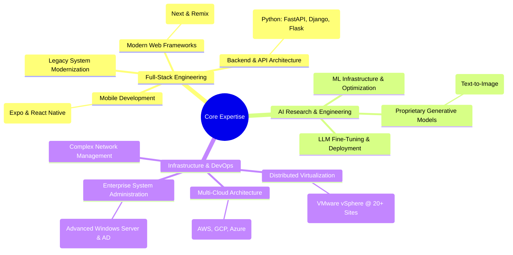

# Hi, I'm Roboto!

### Software Engineer and CTO

> A problem solver who doesn't say no to something new! With over 10 years of software engineering experience, I build reliable, user-friendly products for diverse industries. I have a strong track record of adapting to the bleeding edge and delivering effective solutions that address real-world challenges. Whether your platform is web, desktop, or mobile, I can deliver.

---

### 🛠️ Core Competencies

---

### 💻 Tech I'm actively supporting

| Frontend Development | Backend Development | AI / Machine Learning |
| :--- | :--- | :--- |
| ⚛️ Expo & React Native | 🐍 Python (FastAPI, Django, Flask) | 🧠 Generative AI (Text-to-Image, LLMs) |
| 🚀 Next & Remix Run | 🔥 Firebase, Aws, GCP, DO | 🎨 Model Fine-Tuning & Optimization |
| 💚 Vue 3 | ☁️ Cloud Functions & GraphQL | 📈 ML/LLM Infrastructure |
| 🅰️ Angular & Ionic |  | |
| 💨 Tailwind & Tamagui | | |

---

| Cloud & DevOps | Infrastructure & Virtualization | System & Network Administration |
| :--- | :--- | :--- |
| ☁️ **Platforms:** AWS, GCP, Azure, DigitalOcean | 🖥️ **Virtualization:** Distributed vSphere @ 20+ sites | 🐧 **Linux:** Red Hat, Debian, Custom Loaders |
| 🚀 **PaaS/CI/CD:** Heroku, Vercel, Fly.io | 🏢 **On-Prem Hardware:** Server & Core Service Management | 🪟 **Windows Server:** Active Directory, GP, IIS, etc |
| 🖥️ Self-hosting | 🌐 **Networking:** Firewalls, Switching, VPNs | 🔒 **Security:** Complex RBAC Implementations |

---

### 📈 Professional Experience

**Chief Technology Officer | Studio Management Platform**
*Oct 2023 - Present*

*   Developing a comprehensive business management dashboard for tattoo studios to manage clients, create PDF invoices, track payments, and showcase artist portfolios.
*   Led the conversion of a legacy Angular Ionic application to a modern React Native Expo stack, leveraging Firebase for backend services.

**Founding Software Engineer | Gaming and AI Research Company**
*May 2022 - Oct 2023*

*   As an early innovator in the space, I engineered proprietary AI image generation models years before the technology became widespread.
*   Delivered a full-stack platform for gamers featuring user profiles, analytics, and an advanced AI service utilizing custom-trained models, LoRAs, and ControlNets.
*   Built and launched a proprietary LLM implementation, fine-tuned for a specific online community.
*   **Key Tech:** Remix Run, React Native, Django, FastAPI, Generative AI Models, LLMs, Tailwind.

**Founding Software Engineer | Niche E-commerce Platform**
*Sep 2021 - Sep 2022*

*   Converted a client's Angular Ionic mobile application for a peer-to-peer marketplace to a modern React Native Expo stack, improving performance and developer experience.
*   Utilized the full Firebase suite for all backend functionality.

**Software Engineer | Non-profit**
*Feb 2022 - Apr 2022*

*   Contributed to a project involving Vue, Django, and GraphQL with a focus on ML/LLM implementation.
*   Worked with VueX, Composition API, and Options API to build dynamic front-end experiences.

** Engineer | Public Safety Systems Provider**
*Oct 2018 - Feb 2022*

*   As a partner with a leading public safety solutions provider, I oversaw critical 911/e911 radio and emergency systems, including cell towers, software, and hardware.
*   Managed complex infrastructure, including mission-critical P25 radio systems, WAN/LAN networking (Cisco, HP, Juniper), and a distributed vSphere environment.
*   Developed internal software tools using Svelte, React, Python, and R to streamline operations.

**Specialty Mechnical Engineer | Specialty Engineer Department, Fortune 500**
*Jul 2014 - Jul 2018*

*   Contributed to unique specialty engineering projects (Boeing, SpaceX, Rolls Royce) with a focus on full-stack development and process automation.
*   **Key Tech:** Full Stack Development, Automation, AutoCAD, Siemens NX, Teamcenter, 3d Modeling Automation

**Technician Intern | Internet Service Provider (ISP)**
*Apr 2013 - Jun 2013*

*   Provided technical support and performed system maintenance for server and desktop environments.
*   Gained foundational experience in Windows administration, computer repair, and basic scripting

---

### 🌱 My First Program

My journey into programming started around age 12 when I wrote my first script for Counter-Strike: Source

[*And yes, it still exists!*](https://gamebanana.com/scripts/5708)
